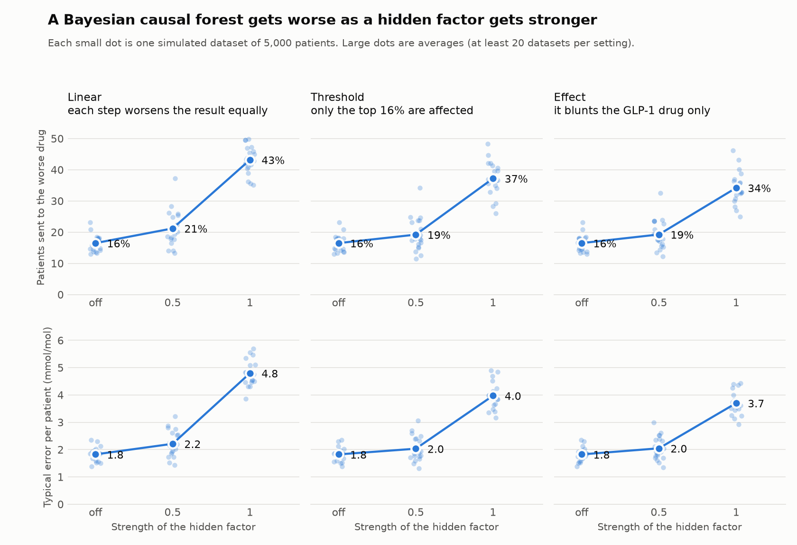
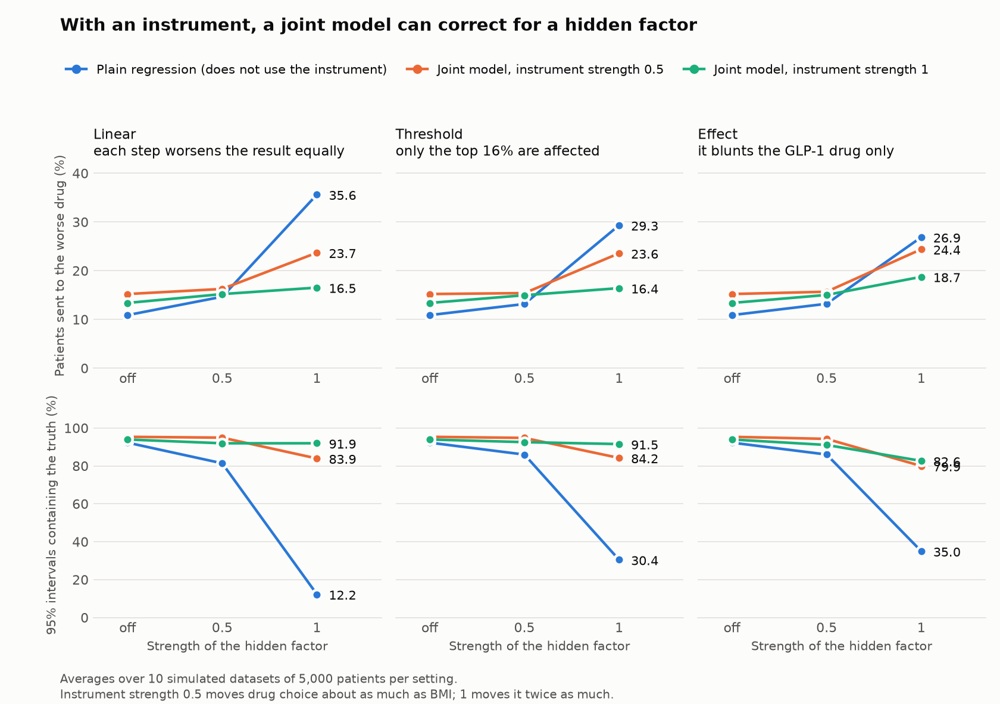

# Hidden-confounding stress test

[](https://github.com/Evelyn68961/hidden-confounding-stress-test/actions/workflows/tests.yml)

A simulation that asks: how wrong does a treatment selection model get when
something that drives the choice of drug is missing from the records, can a
joint model of drug choice and outcome correct for it, and would the usual
validation check notice?

**Author:** Evelyn Chang. Built with an AI coding assistant; see
[How this was built](#how-this-was-built).

**Status:** the four planned steps are done. A plain-language account of the
findings is in [reports/SUMMARY.md](reports/SUMMARY.md).

This is a learning exercise in Python, Bayesian causal forests and PyMC. It
uses simulated patients only. It is not a verdict on any published model.

## Findings at a glance

- **With nothing hidden, a Bayesian causal forest recovers the truth.** Its
  95% intervals contain the true effect for 94.3% of patients.
- **A hidden factor passes straight through it.** At the severe setting the
  forest's error in the average effect is 4.44 mmol/mol, against 4.40 for a
  comparison of the two drug groups with no adjustment, and its intervals
  contain the truth for 28% of patients.
- **A joint model without an instrument cannot correct for it.** The data
  hold almost no information about the hidden link, and the model's answers
  swing widely from one dataset to the next.
- **With a valid instrument it removes all of the error for a linear hidden
  factor, 92% for a threshold form and 54% when the hidden factor changes how
  well a drug works.** A classical two-step method agrees.
- **An invalid instrument does more harm than none.** A direct effect on the
  outcome of 1 mmol/mol makes the joint model worse than a model that ignores
  the instrument.

The third and fourth points use the corrected joint model of
[report 13](reports/13_verification_and_corrected_joint_model.md). An
independent review found that the first joint model assumed one noise level
for both drugs where the simulated patients have two. The tables under
"Results" below are from the first joint model and are kept as they were
reported; report 13 sets the two side by side.

## The problem

Treatment selection models learn from health records which drug works best for
which patient. In records, doctors choose drugs for reasons that are often not
written down, such as frailty.

Suppose frail patients are more often given drug A, and frail patients also
respond worse to any drug. A model sees worse results on drug A and blames the
drug. In real records this cannot be checked, because each patient takes one
drug and their result on the other drug never exists.

## The approach

In a simulation the true effect of each drug on each patient is known, so a
model's estimates can be scored against it.

1. Simulate people with type 2 diabetes starting an SGLT2 inhibitor or a GLP-1
   receptor agonist. The outcome is the change in HbA1c at 12 months.
2. Add a hidden factor that affects both the drug chosen and the outcome. Vary
   its **strength**, and the **shape** of its effect on the outcome:
   - `linear`: each extra unit worsens the result by the same amount;
   - `threshold`: only patients above a cut-off are affected;
   - `effect`: it changes how well one drug works.
3. Hide the factor and fit the models.
4. Score each model against the truth: error in each patient's estimated
   effect, whether the 95% intervals contain the truth, and the share of
   patients who would be sent to the worse drug.

The patients are artificial. They are tuned to resemble the cohort in Cardoso
et al., *Diabetologia* 2024, using only figures printed in that paper. Each
number, its source and how closely the simulation reproduces it are in
[docs/calibration.md](docs/calibration.md).

Strength 0.5 is a hidden factor about as strong on drug choice as BMI.
Strength 1 is twice that, which is a severe setting.

## Steps and reports

| Step | Content | Reports |
|---|---|---|
| 1 | Patient generator; Bayesian causal forest with the hidden factor off; what each setting of the hidden factor does to the data | [01](reports/01_causal_forest_no_hidden_factor.md), [02](reports/02_what_the_hidden_factor_does.md) |
| 2 | Causal forest with the hidden factor on: two strengths, three shapes, 20 datasets each, run on two computers | [03](reports/03_causal_forest_grid.md), [04](reports/04_cross_computer_check.md) |
| 3 | A joint model of drug choice and outcome in PyMC: without an instrument, then with one | [05](reports/05_joint_model_trial_and_check.md), [06](reports/06_joint_model_grid.md), [08](reports/08_instrument.md) |
| 3, addition | The published concordant-against-discordant validation check, applied where the truth is known | [07](reports/07_validation_check.md) |
| 4 | Figures and write-up | [SUMMARY](reports/SUMMARY.md) |
| Follow-ups | Ten more datasets for the instrument; less ideal instruments; the instrument used as a feature; four times as many patients | [09](reports/09_instrument_twenty_datasets.md), [10](reports/10_less_ideal_instruments.md), [11](reports/11_instrument_as_a_feature.md), [12](reports/12_more_patients.md) |
| Verification | An independent code review, a second method for the key numbers, and a joint model with a noise level per drug | [13](reports/13_verification_and_corrected_joint_model.md) |

## Results

Averages across simulated datasets of 5,000 patients. Errors are in mmol/mol
of HbA1c. Every table below has its checks and limits in the linked report.

### A causal forest under a hidden factor ([report 03](reports/03_causal_forest_grid.md))

| Hidden factor | Error in the average effect | Typical error per patient | 95% intervals containing the truth | Patients sent to the worse drug |
|---|---|---|---|---|
| Off | 0.12 | 1.82 | 94.3% | 16.5% |
| Linear, strength 0.5 | 1.39 | 2.21 | 87.3% | 21.2% |
| Linear, strength 1 | 4.44 | 4.80 | 27.6% | 43.2% |
| Threshold, strength 0.5 | 1.06 | 2.03 | 90.5% | 19.2% |
| Threshold, strength 1 | 3.52 | 3.97 | 45.7% | 37.2% |
| Effect, strength 0.5 | 1.06 | 2.05 | 90.1% | 19.3% |
| Effect, strength 1 | 3.18 | 3.70 | 49.8% | 34.2% |



- With nothing hidden, the forest has no systematic lean and its intervals are
  close to honest.
- With the hidden factor on, its error in the average effect matches that of a
  crude comparison of the two drug groups. It removes the confounding it can
  see and none that it cannot.
- Nothing in its output signals the problem: at strength 1 only 28% to 50% of
  its 95% intervals contain the truth.

### A joint model, without and with an instrument ([report 06](reports/06_joint_model_grid.md), [report 08](reports/08_instrument.md))

Linear hidden factor at strength 1:

| Model | Error in the average effect | 95% intervals containing the truth | Patients sent to the worse drug |
|---|---|---|---|
| Plain regression | 4.39 | 9.4% | 39.0% |
| Joint model, no instrument | 4.14 | 78.4% | 37.6% |
| Joint model, instrument of strength 0.5 | 2.28 | 83.9% | 23.7% |
| Joint model, instrument of strength 1 | 0.95 | 91.9% | 16.5% |

The first two rows are from 20 datasets without an instrument; the last two
are from 10 datasets each with one, where the plain regression's error was
4.10 and 3.77.



- Without an instrument, the joint model did not detect the hidden factor in
  any of 140 fits. It did not correct the bias, but its intervals widened and
  became far more honest.
- With an instrument, it corrected most of the bias. A weaker instrument
  corrected less, and the correction was smaller when the hidden factor's form
  departed from the model's assumptions.
- The joint model is noisier, and does slightly worse than the plain
  regression when nothing is hidden.

### The validation check ([report 07](reports/07_validation_check.md))

Treatment selection models are validated in health records by comparing
patients who received the recommended drug with matched patients who did not.
That check was also applied here, where the truth is known. The numbers, the
figure and the reading are in [report 07](reports/07_validation_check.md).

Two limits apply to that report before anything else:

- The matching was written from the description in the published papers, not
  from the authors' code, and may differ from theirs.
- The published models were also validated in randomised trials, where a
  hidden factor cannot drive the choice of drug. The simulation has no trial
  arm.

### Follow-ups and verification ([reports 09 to 13](reports/README.md))

Run after the results above, and reported beside them without changing them.

| Question | Answer |
|---|---|
| Does the instrument result hold on ten new datasets per setting? | Yes. Error removed: 72%, 68% and 39% for the three forms, against 75%, 64% and 40%. |
| Does it survive an instrument shared within a practice? | Yes. The correction is as good as with one value per patient. |
| Does it survive an instrument that also affects the outcome a little? | No. A direct effect of 1 mmol/mol makes the joint model worse than the plain regression, and creates an error of 4.55 mmol/mol when nothing is hidden. |
| What if the instrument is added to the plain regression as a feature? | The error grows by 13% to 17%. |
| Without an instrument, do 20,000 patients help where 5,000 did not? | No. The bias stays, and the intervals narrow until under 1% contain the truth. Report 13 shows the narrowing came from a mismatch in the joint model. |
| Are the numbers and the explanations right? | The numbers are. An independent review found no coding error, and least squares reproduces the plain regression exactly. Four explanations were corrected, and the joint model was refitted with a noise level per drug. |

## Limits

- It is a simulation. The sizes depend on how the patients were built.
- The hidden factor is unrelated to every recorded feature, which is the
  hardest case.
- 5,000 patients per dataset; published models use many more.
- The joint model is the simplest of its kind: normal errors and straight-line
  effects. Flexible versions were not implemented.
- The instrument is ideal. A real one has to be argued for.
- Only two drugs, one outcome, three shapes and two strengths.

## Run it

Requires [uv](https://docs.astral.sh/uv/).

```
uv sync
uv run pytest
uv run python scripts/01_causal_forest_no_hidden_factor.py
uv run python scripts/02_what_the_hidden_factor_does.py
uv run python scripts/03_causal_forest_grid.py     # many hours
uv run python scripts/04_cross_check.py compare
uv run python scripts/05_summarise_grid.py
uv run python scripts/06_joint_model_trial.py
uv run python scripts/07_joint_model_check.py
uv run python scripts/08_joint_model_grid.py       # about 2.5 hours
uv run python scripts/09_validation_framework.py   # about 45 minutes
uv run python scripts/10_instrument_grid.py        # about 2.5 hours
uv run python scripts/11_summarise_step3.py
uv run python scripts/12_followup_runs.py --run realistic       # about 1.5 hours
uv run python scripts/12_followup_runs.py --run as_feature      # about 30 minutes
uv run python scripts/12_followup_runs.py --run more_patients   # about 1 hour
uv run python scripts/12_followup_runs.py --run per_drug_noise  # about 4 hours
uv run python scripts/13_summarise_followups.py
uv run python checks/independent_check_1.py                     # about a minute
uv run python checks/independent_check_2.py
```

To check the reported numbers without refitting anything, run only the tests
and scripts 05, 11 and 13. They rebuild the tables and figures from the saved
results.

The long runs save each result as it finishes and continue where they stopped
if run again. Script 03 can be shared between computers; see
[docs/RUNNER.md](docs/RUNNER.md).

## Layout

- `src/stresstest/generator.py` makes the patients and holds the truth.
- `src/stresstest/causal_forest.py` fits the Bayesian causal forest ([stochtree](https://stochtree.ai/)).
- `src/stresstest/joint_model.py` fits the plain regression and the joint model ([PyMC](https://www.pymc.io/)).
- `src/stresstest/validation.py` is the concordant-against-discordant check.
- `src/stresstest/scoring.py` compares estimates with the truth.
- `docs/calibration.md` lists where each number in the generator comes from.
- `docs/RUNNER.md` explains how a second computer runs part of the long jobs
  without the results getting mixed up.
- `checks/` holds two scripts that recompute key results with least squares
  and a classical two-step correction, using numpy and scipy only.
- `tests/` checks the generator, including that the simulated cohort matches
  the published figures, and the validation check.
- `scripts/` holds one numbered script per run or analysis.
- `reports/` holds one progress report per run: the question, what was run,
  the result, how to read it and its limits. Start at
  [reports/README.md](reports/README.md) or [reports/SUMMARY.md](reports/SUMMARY.md).
- `results/generator-v<N>/` holds the saved output of the long runs: one
  folder per version of the generator, one file per computer. Results from
  different versions are never pooled. The files and their columns are
  described in [results/README.md](results/README.md).

## How this was built

The code, reports and figures were written with an AI coding assistant
(Claude Code), as the commit history shows. The author chose the question,
decided the design in discussion with the assistant, and reviewed each result
before the next step.

- **Checks that changed the work.** The first version of the simulated
  patients did not reproduce the published outcome in both drug groups. It was
  replaced, and its results are kept apart in `results/generator-v1/` and used
  nowhere. The first forest fits ran one chain; all reported fits run four.
- **Two computers.** The long runs were shared between two computers, each
  operated by an assistant session. The reports and logs call them the lead
  and the runner. [Report 04](reports/04_cross_computer_check.md) shows they
  simulate the same patients and give the same scores.
- **What is reproducible.** Every result row records the commit of the code
  that produced it. The two summary scripts rebuild every table and figure in
  `reports/` from the saved results in a few seconds.

## References

- Cardoso P, Young KG, Nair ATN, et al. Phenotype-based targeted treatment of
  SGLT2 inhibitors and GLP-1 receptor agonists in type 2 diabetes.
  *Diabetologia* 2024;67:822–836.
- Dennis JM, Young KG, Cardoso P, et al. A five-drug class model using
  routinely available clinical features to optimise prescribing in type 2
  diabetes. *Lancet* 2025;405:701–714.
- Dennis JM, Young KG, McGovern AP, et al. Development of a treatment
  selection algorithm for SGLT2 and DPP-4 inhibitor therapies in people with
  type 2 diabetes. *Lancet Digit Health* 2022;4:e873–e883.
- Conley TG, Hansen CB, McCulloch RE, Rossi PE. A semi-parametric Bayesian
  approach to the instrumental variable problem. *J Econometrics*
  2008;144:276–305.
- Hahn PR, Murray JS, Carvalho CM. Bayesian regression tree models for causal
  inference: regularization, confounding, and heterogeneous effects. *Bayesian
  Analysis* 2020;15(3):965–1056.
- Brooks JM, Chapman CG, Chen BK, Floyd SB, Hikmet N. Assessing the properties
  of patient-specific treatment effect estimates from causal forest algorithms
  under essential heterogeneity. *BMC Med Res Methodol* 2024;24:66.
