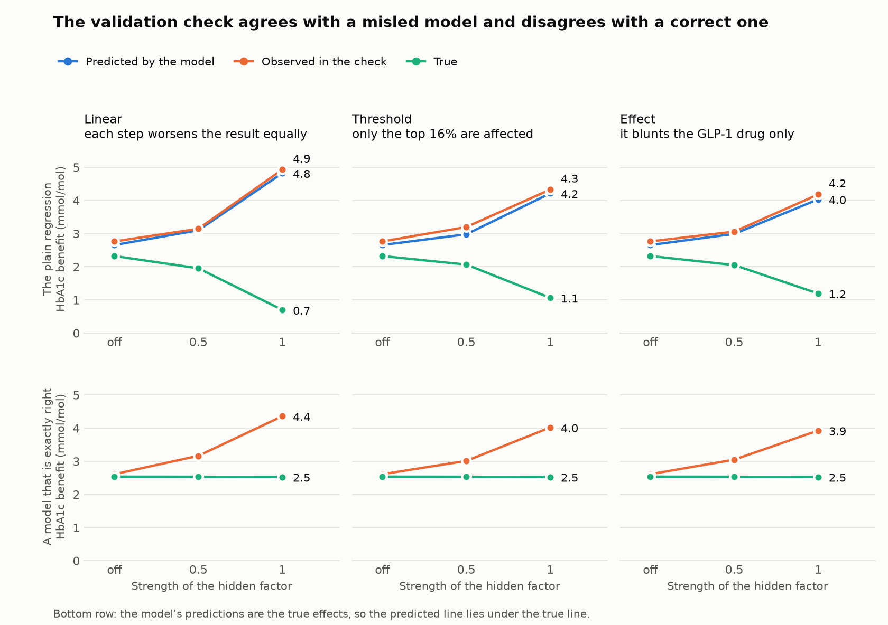

# Report 07: does the published validation check notice a misled model?

**Date:** 2026-10-07
**Scripts:** `scripts/09_validation_framework.py` (the run), `scripts/11_summarise_step3.py` (table and figure)
**Code:** `src/stresstest/validation.py`, tested in `tests/test_validation.py`
**Results:** `results/generator-v2/validation/EVELYN68961.csv` (280 rows: two "models" × 140 datasets)
**Table:** `reports/tables/step3_validation_check.csv`
**Code commit recorded in every row:** c065cd2

## Question

Treatment selection models built on health records cannot be checked one
patient at a time, because nobody is observed on both drugs. Dennis et al.
(*Lancet Digit Health* 2022; *Lancet* 2025) check them in groups: patients who
received the model's recommended drug ("concordant") are matched to similar
patients who did not ("discordant"), and the **observed** difference in their
outcomes is compared with the benefit the model **predicted**. Agreement is
read as evidence that the model works.

That comparison uses the same records as the model. If a hidden factor has
misled the model, does the check notice?

## What was run

- The 140 simulated datasets of step 2 (5,000 patients each; seven
  hidden-factor settings; 20 datasets per setting).
- The check was applied to two sets of predictions for each dataset:
  - **the plain regression** of step 3 (an outcome regression with
    drug-by-feature interactions, the same structure as the published
    models), fitted to that dataset;
  - **the truth**: the true effects, used as if they were a model's
    predictions. This shows what the check reports for a model that is
    exactly right.
- Matching as described in the papers: exact on sex and on starting HbA1c in
  twenty equal-sized groups, then the nearest neighbour with replacement on a
  score built from all features, within a caliper of 0.05.
- Because the data are simulated, a third quantity is available: the **true**
  benefit in the matched pairs.

All benefits are in mmol/mol of HbA1c. Positive means the concordant patient's
drug lowers HbA1c more.

## Result

Averages across 20 datasets per setting. About 2,400 to 3,300 matched pairs
per dataset.

### The check applied to the plain regression

| Hidden factor | Predicted benefit | Observed benefit (SD between datasets) | True benefit | Observed minus predicted | Patients the model sends to the worse drug |
|---|---|---|---|---|---|
| Off | 2.66 | 2.76 (0.61) | 2.32 | +0.11 | 12.1% |
| Linear, 0.5 | 3.10 | 3.15 (0.79) | 1.95 | +0.05 | 16.3% |
| Linear, 1 | 4.82 | 4.93 (0.75) | 0.70 | +0.11 | 39.0% |
| Threshold, 0.5 | 2.98 | 3.20 (0.60) | 2.07 | +0.22 | 14.5% |
| Threshold, 1 | 4.21 | 4.33 (0.71) | 1.06 | +0.11 | 32.9% |
| Effect, 0.5 | 2.99 | 3.06 (0.75) | 2.05 | +0.07 | 14.5% |
| Effect, 1 | 4.03 | 4.18 (0.78) | 1.19 | +0.15 | 30.4% |

### The check applied to a model that is exactly right

| Hidden factor | Predicted benefit | Observed benefit (SD) | True benefit | Observed minus predicted |
|---|---|---|---|---|
| Off | 2.53 | 2.61 (0.73) | 2.53 | +0.08 |
| Linear, 0.5 | 2.53 | 3.16 (0.77) | 2.53 | +0.63 |
| Linear, 1 | 2.53 | 4.36 (0.79) | 2.53 | +1.83 |
| Threshold, 0.5 | 2.53 | 3.01 (0.80) | 2.53 | +0.48 |
| Threshold, 1 | 2.53 | 4.02 (0.77) | 2.53 | +1.49 |
| Effect, 0.5 | 2.53 | 3.05 (0.77) | 2.53 | +0.52 |
| Effect, 1 | 2.53 | 3.93 (0.80) | 2.53 | +1.40 |

## Reading

1. **With nothing hidden, the check works.** For both the plain regression
   and the perfect model, the observed benefit is within about 0.1 mmol/mol of
   the predicted one.

2. **With a hidden factor, the check still passes the misled model.** For the
   plain regression, observed and predicted benefit agree to within 0.05 to
   0.22 mmol/mol at every setting. At the linear shape and strength 1 the
   model predicts a benefit of 4.82, the check observes 4.93, and the true
   benefit is 0.70. That model sends 39% of patients to the worse drug.

3. **The more the model is misled, the larger the benefit it appears to
   deliver.** As the hidden factor strengthens, the predicted and observed
   benefit rise together (2.7 to 4.9) while the true benefit falls (2.3 to
   0.7).

4. **The same hidden factor makes the check fail a correct model.** For the
   perfect model the observed benefit exceeds the predicted one by 1.4 to 1.8
   mmol/mol at strength 1. Read in the usual way, that would be taken as a
   sign that the model is miscalibrated.

5. **Why.** The check compares patients who received different drugs. The
   hidden factor is unevenly spread between the drugs, so it is unevenly
   spread between concordant and discordant patients too. Matching on recorded
   features cannot remove it. The model's predictions and the check's observed
   differences are distorted by the same thing, in the same direction, so they
   agree with each other and not with the truth.

6. **The direction depends on the prescribing mix.** Here three patients in
   four receive the SGLT2 drug and the hidden factor favours the GLP-1 drug,
   so most concordant patients are low on the hidden factor and do well for
   that reason. With a different mix or a hidden factor of opposite sign the
   distortion could run the other way.

## What this does and does not say

- It says that agreement between predicted and observed benefit **within the
  same health records** cannot rule out a hidden factor, and can be at its
  best when the model is most misled.
- It does **not** say the published models are wrong. Nothing here uses real
  data, and the strength of any hidden factor in real prescribing is unknown.
- The published validation did not rest on health records alone. The 2022 and
  2025 papers also checked the models in randomised trials, where a hidden
  factor cannot drive the choice of drug. This simulation has no trial arm, so
  it says nothing about that part. It does illustrate why that part matters.
- The 2022 paper states the limit itself: because treatment was not assigned
  at random, the estimated effects "do not have a causal interpretation".

## Checks

- **The implementation was tested before use.** With 100,000 patients, nothing
  hidden and the true effects as the model, predicted, observed and true
  benefit were 2.50, 2.57 and 2.50. With random numbers as the model, the true
  and observed benefit were near zero.
- **An earlier version of the matching score was wrong and was fixed before
  the run.** It gave every feature one slope, which left a gap of 0.4 mmol/mol
  between observed and true benefit with nothing hidden. Being concordant
  means receiving the GLP-1 drug for some patients and not receiving it for
  others, so each feature needs a slope for each group.
- **Small-sample residue.** At 5,000 patients and nothing hidden, the observed
  benefit still exceeds the true one by about 0.1 (perfect model) to 0.4
  (plain regression). The effects reported above are several times larger.

## Limits

- **My reading of the matching.** The papers describe the matching in a
  sentence. The score used here (a logistic regression for being concordant)
  is one reasonable implementation, not the authors' code.
- **Two drugs, not five.** With five drugs a discordant comparator can be on
  any of four other drugs.
- **Only the plain regression was checked,** not the causal forest. The forest
  was not refitted because its per-patient estimates were not saved in step 2.
  Its error in the average effect matched the plain regression's, so the same
  behaviour is expected, but it was not measured.
- **Only the first part of the published framework.** The papers also compare
  observed and predicted differences within groups defined by predicted
  benefit, with covariate adjustment. That part was not implemented.
- The limits of report 03 apply: a simulation, 5,000 patients per dataset, a
  hidden factor unrelated to every recorded feature, three shapes and two
  strengths.
